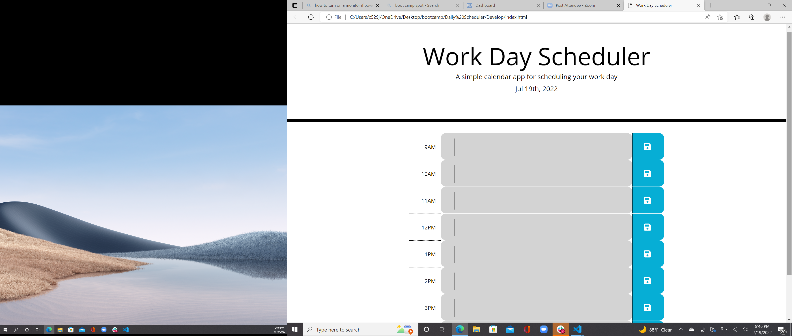

# <Personal Portfolio>

## Description


For this project, I was tasked with creating a daily scheduler that would display the current day and timeblocks for the hours of a work day. The project also needed to color code the timeblocks based on if they were in the past, present or future as well as save notes written in each timeblock to local storage. The page functioned in that when notes were written in the timeblocks, a button was attached to the timeblock and if it was clicked, the written note would both be stored in local storage and render to the page on load. The page also shows different colors based on the time of day. My motivation to complete this project was to better understand how to apply third party APIs to javascript and CSS to simplfy certain processes. This project was also useful in learning more about how to use local storage and make sure certain aspects of a page will stay on the page after it has been closed.

## Installation

To install the daily scheduler, I used the given html and css documents to create a javascript document that would add the needed functionality to the page. I then created a github repository, cloned that repository to my local device, copied the code files to the repository, pushed the files to the repository on github, and then enabled pages on github to create a live link. 

## Usage

    ```md
    
    ```
    

## Credits

I recieved help on this project from my instructors, Henery Winget and Chris Sinlasath.

